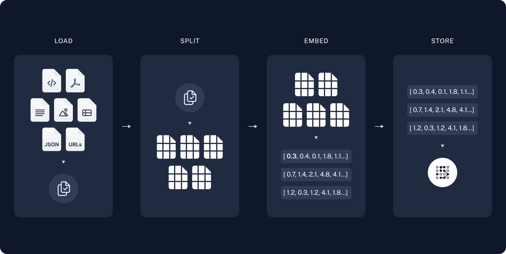

# RAG Chatbot with Hugging Face, Langchain and Gradio

This project implements a Retrieval-Augmented Generation (RAG) chatbot that answers questions based on provided PDF documents. The bot uses Hugging Face Transformers for language model tasks and Sentence Transformers for text embeddings.

## Features

- Upload a PDF document
- Ask any question related to the document
- Get responses based on document context using RAG

## Model Choices

- **Language Model (LLM)**: `google/flan-t5-large`
- **Embedding Model**: `sentence-transformers/all-MiniLM-L6-v2`

## Setup and Installation

### Prerequisites

- Python 3.8 or above

### Installation Steps

1. Clone this repository:

    ```bash
    git clone <repository-url>
    cd <repository-directory>
    ```

2. Install the required packages:

    ```bash
    pip install -r requirements.txt
    ```

3. Run the application:

```bash
python qa_bot.py
```

## Usage

1. After starting the app, open a browser and go to `<http://localhost:8000>`
2. Upload a PDF file in the application.
3. Type a question related to the document in the text box and click `Submit`.
4. The bot will answer based on the document content.
5. Example
   1. Upload a PDF (e.g., [LoRA in LLM Context](https://cf-courses-data.s3.us.cloud-object-storage.appdomain.cloud/WgM1DaUn2SYPcCg_It57tA/A-Comprehensive-Review-of-Low-Rank-Adaptation-in-Large-Language-Models-for-Efficient-Parameter-Tuning-1.pdf))
   2. Ask a question (e.g., "What is LoRA")
   3. The chatbot will respond with relevant information from the document.

## Project Structure

- `QABot Class`: Handles the loading, processing, and retrieval of documents and queries.
- `main() function`: Initializes the Gradio interface and runs the chatbot.

## Technical Details

1. PDF Loading: Utilizes PyPDFLoader to load and process PDF files into text.
2. Text Splitting: Documents are split into manageable chunks for embedding using RecursiveCharacterTextSplitter.
3. Vector Store: Chroma is used to store and retrieve embeddings of text chunks.
4. Question-Answering: Combines retrieved document context with the LLM to generate answers.

<div style="text-align: center; margin-top: 30px;">
  
  <h3 style="margin: 2px 0;">Documents embedding and VectorStore</h3>
  <p style="margin: 2px 0;"><a href="https://python.langchain.com/docs/tutorials/rag/" target="_blank">Source: Langchain</a></p>
</div>

<br />

<div style="text-align: center; margin-top: 30px;">
  
  <h3 style="margin: 2px 0;">RAG Flow</h3>
  <p style="margin: 2px 0;"><a href="https://python.langchain.com/docs/tutorials/rag/" target="_blank">Source: Langchain</a></p>
</div>

## Requirements

- Hugging Face Transformers for text2text generation
- Sentence Transformers for embeddings
- Gradio for creating an interactive web UI
- Chroma for vector database and retrieval

## References

- [Langchain-Huggingface](https://python.langchain.com/api_reference/huggingface/index.html)
- [Huggingface pipeline](https://huggingface.co/docs/transformers/v4.46.2/en/main_classes/pipelines#pipelines)
- [Huggingface: Text generation strategies](https://huggingface.co/docs/transformers/generation_strategies)
- [Langchain - How To](https://python.langchain.com/docs/how_to/)
- [Lanchain RAG tutorial](https://python.langchain.com/docs/tutorials/rag/)
- Langchain vectorstores
  - [https://python.langchain.com/api_reference/core/vectorstores.html](https://python.langchain.com/api_reference/core/vectorstores.html)
  - [https://python.langchain.com/docs/how_to/#vector-stores](https://python.langchain.com/docs/how_to/#vector-stores)
